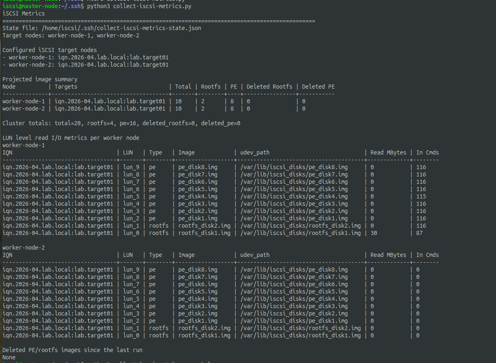
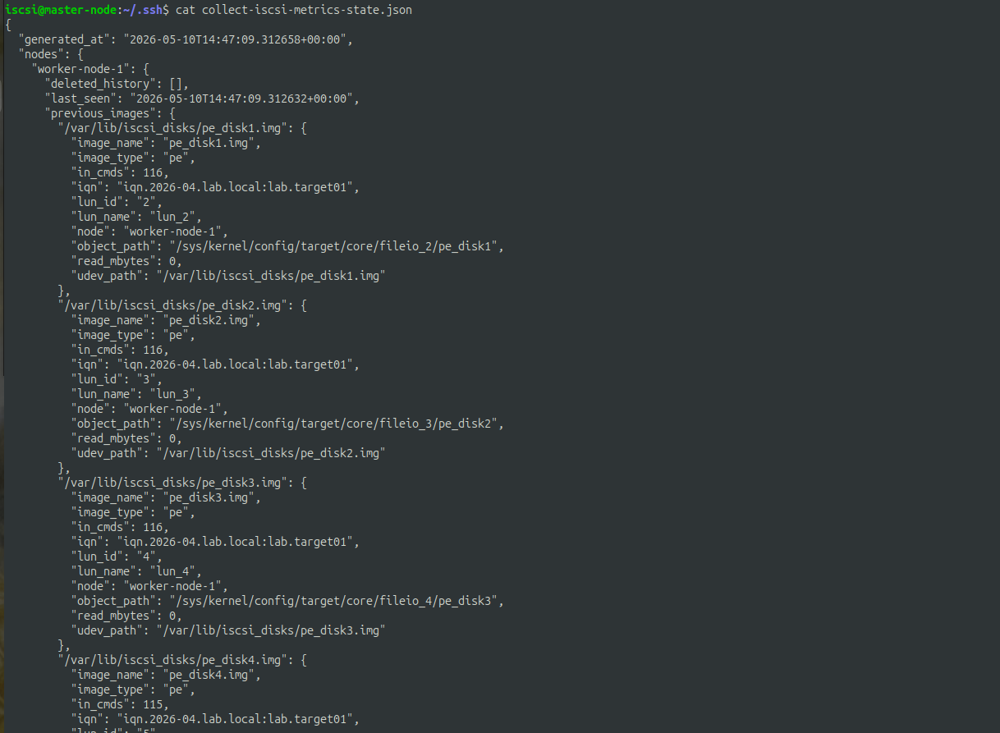

# Complete Setup Commands

## 1. Create VMs

- 1 Master + 3 Worker Node VMs
- OS = Ubuntu Server 24.04
- Create 1 master-node vm with name master-node
- Create 2 iscsi-target vms with names worker-node-1 & worker-node-2
- Create 1 iscsi-client vm with name worker-node-3

- Notes: Install OpenSSH Server during Ubuntu Installation

## 2. Configure iSCSI Targets and Clients

### 1. iSCSI Target

Setup:

10 Fileio Backstore Images + LUNs ( Size = 50MB )

- 2 Rootfs Images (eg: rootfs_disk01.img)
- 8 PE Images (eg: pe_disk01.img)

  ```
  Target
  └── TPG1
     ├── lun0 -> rootfs_disk01
     ├── lun1 -> rootfs_disk02
     ├── ...
     ├── lun9 -> pe_disk08
     └── ACLs
           └── initiator IQN
  ```

To configure a new ubuntu VM as iscsi-target with above architecture, run the following commands:

1. Create a script file

   ```
   nano iscsi-target-setup.sh
   ```

2. Copy the below script into the file

   ```bash
   #!/bin/bash
   set -e

   BASE_DIR="/var/lib/iscsi_disks"
   PORTAL_IP="0.0.0.0"
   PORTAL_PORT="3260"

   TARGET_IQN="iqn.2026-04.lab.local:lab.target01"

   echo "[+] Installing targetcli"
   apt-get update
   apt-get install -y targetcli-fb

   echo "[+] Creating disk directory"
   mkdir -p ${BASE_DIR}

   echo "[+] Cleaning old disk images"
   rm -f ${BASE_DIR}/*.img

   echo "[+] Resetting existing target configuration"
   targetcli clearconfig confirm=True || true

   echo "[+] Creating rootfs disks (2)"

   for i in $(seq -w 1 2); do
      targetcli /backstores/fileio create \
         rootfs_disk${i} \
         ${BASE_DIR}/rootfs_disk${i}.img \
         50M
   done

   echo "[+] Creating PE disks (8)"

   for i in $(seq -w 1 8); do
      targetcli /backstores/fileio create \
         pe_disk${i} \
         ${BASE_DIR}/pe_disk${i}.img \
         50M
   done

   echo "[+] Creating iSCSI target"
   targetcli /iscsi create ${TARGET_IQN}

   echo "[+] Creating portal"
   targetcli /iscsi/${TARGET_IQN}/tpg1/portals create \
   ${PORTAL_IP} ${PORTAL_PORT} || true

   echo "[+] Disabling authentication (no CHAP)"
   targetcli /iscsi/${TARGET_IQN}/tpg1 set attribute authentication=0

   echo "[+] Enabling dynamic ACLs (allow all initiators)"
   targetcli /iscsi/${TARGET_IQN}/tpg1 set attribute generate_node_acls=1

   echo "[+] Mapping rootfs disks as LUNs"

   for i in $(seq -w 1 2); do
      targetcli /iscsi/${TARGET_IQN}/tpg1/luns create \
         /backstores/fileio/rootfs_disk${i}
   done

   echo "[+] Mapping PE disks as LUNs"

   for i in $(seq -w 1 8); do
      targetcli /iscsi/${TARGET_IQN}/tpg1/luns create \
         /backstores/fileio/pe_disk${i}
   done

   echo "[+] Saving configuration"
   targetcli saveconfig

   echo "[+] Enabling target service"
   systemctl enable rtslib-fb-targetctl

   echo "[+] Setup complete"
   ```

3. Give execution permission to the script

   ```

   chmod +x iscsi-target-setup.sh

   ```

4. Run the script as sudo user

   ```

   sudo ./iscsi-target-setup.sh

   ```

5. Verify the setup

   ```

   sudo targetcli ls

   ```

### 2. iSCSI Client

To configure a new ubuntu VM as iscsi-client to work with above iscsi-setup, run the following commands:

1. Create a script file

   ```

   nano iscsi-client-setup.sh

   ```

2. Copy the below code to the script and modify the `TARGET_IP` and `CLIENT_IQN` if needed

   ```bash
   #!/bin/bash
   set -e

   # Target portal
   PORTAL="192.168.122.242:3260"

   CLIENT_IQN="iqn.2026-04.lab.local:node1.initiator"

   echo "[+] Cleaning previous iSCSI client configuration"
   systemctl stop open-iscsi || true
   systemctl stop iscsid || true
   iscsiadm -m node --logout || true
   iscsiadm -m node -o delete || true
   rm -rf /etc/iscsi/nodes/*
   rm -rf /etc/iscsi/send_targets/*
   apt purge open-iscsi -y

   echo "[+] Installing open-iscsi"
   apt-get update -y
   apt-get install -y open-iscsi

   echo "[+] Setting initiator IQN"
   sed -i "s|^InitiatorName=.*|InitiatorName=${CLIENT_IQN}|" /etc/iscsi/initiatorname.iscsi

   echo "[+] Restarting services"
   systemctl restart iscsid
   systemctl restart open-iscsi

   echo "[+] Discovering targets"
   iscsiadm -m discovery -t sendtargets -p ${PORTAL}

   echo "[+] Logging into discovered targets"
   iscsiadm -m node --login || true

   echo "[+] Enabling auto-login on boot"
   iscsiadm -m node -o update -n node.startup -v automatic

   echo "[+] Verifying sessions"
   iscsiadm -m session

   echo "[+] Checking block devices"
   lsblk

   echo "[+] iSCSI client setup complete"
   ```

3. Verify the session and see the lun to disks mapping

   ```
   sudo iscsiadm -m session -P 3
   ```

4. Perform I/O operations on the disk
   - Write IO

   ```
   sudo dd if=/dev/zero of=/dev/sda bs=1M count=10 status=progress
   ```

   - Read IO

   ```
   sudo dd if=/dev/sda of=/dev/null bs=1M count=10 status=progress
   ```

5. Check the iSCSI target in path `/sys/kernel/config/target` for metrics

## 3. Install Kubernetes in all the VMs

### 1. Containerd Setup:

1. Install and configure prerequisites
   - Enable IPv4 packet forwarding

     ```
     # sysctl params required by setup, params persist across reboots
     cat <<EOF | sudo tee /etc/sysctl.d/k8s.conf
     net.ipv4.ip_forward = 1
     EOF

     # Apply sysctl params without reboot
     sudo sysctl --system
     ```

     Verify that net.ipv4.ip_forward is set to 1 with:

     ```
     sysctl net.ipv4.ip_forward
     ```

2. Install Containerd
   - Download the containerd-<VERSION>-<OS>-<ARCH>.tar.gz archive from https://github.com/containerd/containerd/releases , verify its sha256sum, and extract it under /usr/local:
     ```
     $ wget https://github.com/containerd/containerd/releases/download/v2.3.0/containerd-2.3.0-linux-amd64.tar.gz
     ```
     ```
     $ sudo tar Cxzvf /usr/local containerd-2.3.0-linux-amd64.tar.gz
     bin/
     bin/containerd-shim-runc-v2
     bin/containerd-shim
     bin/ctr
     bin/containerd-shim-runc-v1
     bin/containerd
     bin/containerd-stress
     ```
   - Configure systemd
     Download the containerd.service unit file from https://raw.githubusercontent.com/containerd/containerd/main/containerd.service into `/usr/local/lib/systemd/system/containerd.service`:

     ```
     wget https://raw.githubusercontent.com/containerd/containerd/main/containerd.service
     sudo mkdir /usr/local/lib/systemd
     sudo mkdir /usr/local/lib/systemd/system
     sudo mv containerd.service /usr/local/lib/systemd/system
     ```

     Enable the containerd service

     ```
     systemctl daemon-reload
     systemctl enable --now containerd
     ```

   - Install runc
     Download the runc.<ARCH> binary from https://github.com/opencontainers/runc/releases , verify its sha256sum, and install it as /usr/local/sbin/runc.
     ```
     wget https://github.com/opencontainers/runc/releases/download/v1.4.2/runc.amd64
     sudo install -m 755 runc.amd64 /usr/local/sbin/runc
     ```
   - Install CNI plugins
     Download the cni-plugins-<OS>-<ARCH>-<VERSION>.tgz archive from https://github.com/containernetworking/plugins/releases , verify its sha256sum, and extract it under /opt/cni/bin:
     ```
     $ wget https://github.com/containernetworking/plugins/releases/download/v1.9.1/cni-plugins-linux-amd64-v1.9.1.tgz
     $ sudo mkdir -p /opt/cni/bin
     $ sudo tar Cxzvf /opt/cni/bin cni-plugins-linux-amd64-v1.9.1.tgz
     ./
     ./macvlan
     ./static
     ./vlan
     ./portmap
     ./host-local
     ./vrf
     ./bridge
     ./tuning
     ./firewall
     ./host-device
     ./sbr
     ./loopback
     ./dhcp
     ./ptp
     ./ipvlan
     ./bandwidth
     ```

3. Configure systemd cgroup driver
   - Generate the defauly config file

   ```
    sudo mkdir -p /etc/containerd
    containerd config default | sudo tee /etc/containerd/config.toml
   ```

   - Open the file at location `/etc/containerd/config.toml.`
     To use the systemd cgroup driver in `/etc/containerd/config.toml` with runc, set the following config: (Containerd versions 2.x)

   ```
   sudo nano /etc/containerd/config.toml
   ```

   ```
   [plugins.'io.containerd.cri.v1.runtime'.containerd.runtimes.runc]
       [plugins.'io.containerd.cri.v1.runtime'.containerd.runtimes.runc.options]
       SystemdCgroup = true
   ```

   - You need CRI support enabled to use containerd with Kubernetes. Make sure that cri is not included in thedisabled_plugins list within `/etc/containerd/config.toml`. If you made changes to that file, also restart containerd.

   ```
   sudo systemctl restart containerd
   ```

- Reference: https://v1-34.docs.kubernetes.io/docs/setup/production-environment/container-runtimes/, https://github.com/containerd/containerd/blob/main/docs/getting-started.md

### 2. Install kubeadm, kubectl, kubelet:

1. Turn the swap memory off: `sudo swapoff -a`
2. Make sure the containerd runtime is installed
3. Install kubeadm, kubectl, kubelet

   ```
   sudo apt-get update
   # apt-transport-https may be a dummy package; if so, you can skip that package
   sudo apt-get install -y apt-transport-https ca-certificates curl gpg

   # If the directory `/etc/apt/keyrings` does not exist, it should be created before the curl command, read the note below.
   # sudo mkdir -p -m 755 /etc/apt/keyrings
   curl -fsSL https://pkgs.k8s.io/core:/stable:/v1.35/deb/Release.key | sudo gpg --dearmor -o /etc/apt/keyrings/kubernetes-apt-keyring.gpg

   # This overwrites any existing configuration in /etc/apt/sources.list.d/kubernetes.list
   echo 'deb [signed-by=/etc/apt/keyrings/kubernetes-apt-keyring.gpg] https://pkgs.k8s.io/core:/stable:/v1.35/deb/ /' | sudo tee /etc/apt/sources.list.d/kubernetes.list

   sudo apt-get update
   sudo apt-get install -y kubelet kubeadm kubectl
   sudo apt-mark hold kubelet kubeadm kubectl

   sudo systemctl enable --now kubelet
   ```

- Reference: https://kubernetes.io/docs/setup/production-environment/tools/kubeadm/install-kubeadm/

### 3. Configure Kubernetes Cluster:

1.  Create a cluster
    `    sudo kubeadm init --apiserver-advertise-address=192.168.122.244 --pod-network-cidr=10.244.0.0/16`

    192.168.122.244 - IP address of master node on the control plane in the VM network

    ```
    mkdir -p $HOME/.kube
    sudo cp -i /etc/kubernetes/admin.conf $HOME/.kube/config
    sudo chown $(id -u):$(id -g) $HOME/.kube/config
    ```

2.  Install CNI - flannel

    ```
    kubectl apply -f https://github.com/flannel-io/flannel/releases/latest/download/kube-flannel.yml
    ```

3.  Join the worker nodes to the cluster
    Run this command on every worker node VM

    ```
    kubeadm join 192.168.122.244:6443 --token akr5qs.2sjct3gngrcmd7rz \
    --discovery-token-ca-cert-hash sha256:fbf1d89ad0fef47ee89e56ae8fbbf13fcbcaf3205d8ad9d8f5c974fe1f04255b
    ```

    Replace the command with what you get after initialization

4.  Add iscsi-target label to target nodes in k8s cluster

    ```
     kubectl label node worker-node-1 iscsi-target=true
     kubectl label node worker-node-2 iscsi-target=true
    ```

5.  Error Handling

    If kube flannel pod is failing for the node with the error:

    ```
    Failed to check br_netfilter: stat /proc/sys/net/bridge/bridge-nf-call-iptables: no such file or directory
    ```

    Run these commands in the worker node:

    ```
    sudo modprobe br_netfilter
    sudo modprobe bridge
    sudo modprobe vxlan
    sudo modprobe overlay
    ```

    ```
    printf "overlay\nbr_netfilter\nvxlan\n" | sudo tee

    cat <<EOF | sudo tee /etc/sysctl.d/k8s.conf
    net.ipv4.ip_forward=1
    net.bridge.bridge-nf-call-iptables=1
    net.bridge.bridge-nf-call-ip6tables=1
    EOF
    ```

    ```
    sudo sysctl --system
    ```

    ```
    sudo systemctl restart containerd
    sudo systemctl restart kubelet
    ```

    Run these commands in the control plane:

    ```
    kubectl delete pods -n kube-flannel --all
    kubectl get pods -n kube-flannel -w
    kubectl get nodes -w
    ```

        - Reference: https://kubernetes.io/docs/setup/production-environment/tools/kubeadm/create-cluster-kubeadm/

## 4. Test the CLI Functionalities

- Run `python3 collect-iscsi-metrics.py`

  

- Check the state file content: `cat collect-iscsi-metrics-state.json`

  

## 5. Assumptions and Limitiations

This collector assumes the following to work correctly:

- The cluster API is reachable and `kubectl get nodes` returns the worker nodes labeled as iSCSI targets.
- The target nodes are selected by the label `iscsi-target=true` unless a different selector is passed.
- `pdsh` is installed and can execute remote commands on those worker nodes.
- The iSCSI target tree exists at `/sys/kernel/config/target/iscsi` unless overridden.
- Each valid target is represented by an `iqn.*` directory with a `tpgt_1` child.
- Each LUN is exposed as a `lun_*` directory under `.../tpgt_1/lun`.
- Each LUN can be resolved to a backend object using `readlink -f`.
- The backend object exposes `udev_path`, and that value is used as the stable image identity.
- Image type is inferred from the identity string, mainly by matching `rootfs`, `pe`, or `pe_`.
- The LUN stats files `read_mbytes` and `in_cmds` exist and contain parseable integer values.
- Deleted images are detected by comparing the current `udev_path` snapshot to the previous snapshot stored in the JSON state file.
- `--reset-state` starts deletion tracking fresh by clearing the saved state first.
- `--no-state-update` allows a read-only run, but then deletion tracking will not advance for the next run.

**Main limitations**:

- Deleted-image reporting is only as accurate as the local JSON history. If the file is removed or reset, past deletions are forgotten.
- If `udev_path` or the backend object name changes, the script may treat the same image as a different one.
- If a target node is temporarily unreachable, its metrics may be missing or incomplete for that run.
- The script currently relies on naming conventions to classify `rootfs` vs `pe`.
