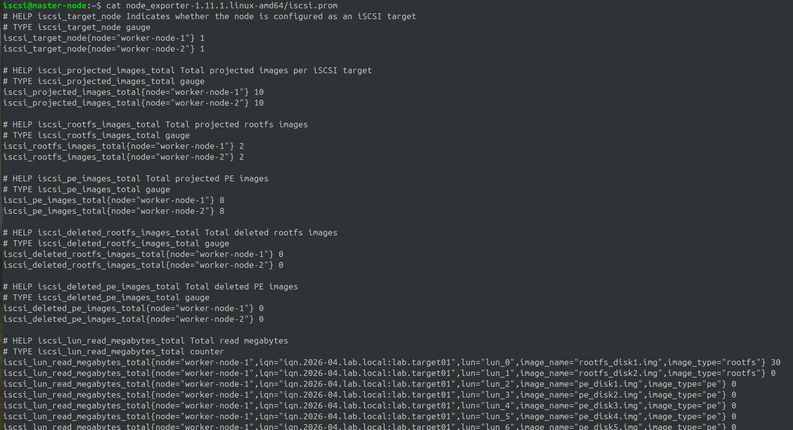

# Prometheus + Node Exporter Setup on the Master Node

All iSCSI-related data is collected with `pdsh` through the existing CLI functions.
After collection, instead of printing a table, the new CLI accepts a `--prometheus-textfile <FILE_PATH>` flag, writes the output to that path in a Prometheus-compatible format, and uses the Node Exporter textfile collector to expose the metrics.

Note: this method is not a continuous monitoring solution. It periodically retrieves iSCSI-related data and records it in the textfile collector with only small changes to the existing CLI.

## Installing Prometheus and Node Exporter

1. Download the Prometheus and Node Exporter packages from https://prometheus.io/download/
2. Extract the packages

```
tar xvfz prometheus-x.xx.x.linux-amd64.tar.gz
tar xvfz node_exporter-*.*-amd64.tar.gz
```

3. Start Node Exporter with the textfile collector directory flag

```
./node_exporter   --collector.textfile.directory=./
```

4. Configure the `exporter.yml` file for Prometheus. Modify the configuration below as needed

```
global:
  scrape_interval: 5s
scrape_configs:
  - job_name: node
    static_configs:
      - targets: ["localhost:9100"]
```

5. Start the Prometheus server with the `exporter.yml` file

```
./prometheus --config.file=exporter.yml
```

6. Run the Python script in the configured setup, following the complete setup guide in the Week 10 folder

```
python3 collect-iscsi-data.py   --prometheus-textfile  ./node_exporter-1.11.1.linux-amd64/iscsi.prom
```

7. Check the data written to the `iscsi.prom` file

```
cat iscsi.prom
```

## Results:


