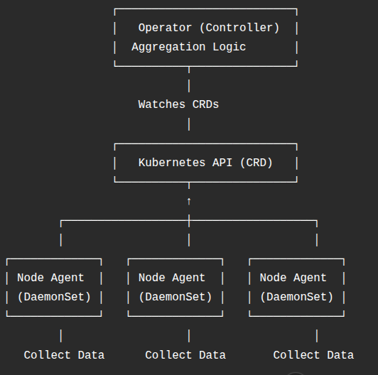

# Kubernetes iSCSI SBPS Data Collection

## Overview

This project explores different ways to collect **iSCSI-related data** from Kubernetes worker nodes and aggregate it at the master node.

### Cluster Setup

- 1 Master Node  
- 2 iSCSI Target Nodes  
- 2 iSCSI Client Nodes  

**Environment:**  
SLES / openSUSE + Kubernetes  

---

## Architecture Diagram



---

## Objective

The goal was to design a **clean, scalable, and Kubernetes-native system** to track:

- Nodes acting as iSCSI targets  
- Number of projected rootfs / PE images  
- Total images across the cluster  
- Number of deleted images per node  

---

## Initial Approaches

### 1. DaemonSet + HTTP Endpoint

**Idea:**
- Run an agent on each node using a DaemonSet  
- Expose metrics via `/metrics` endpoint  
- Master node queries each pod  

**Issues:**
- Required service discovery  
- Not fully Kubernetes-native  
- Security concerns (exposed endpoints)  

---

### 2. Custom Resource Definitions (CRDs)

**Approach:**
Each node updates its status using a CRD:

```yaml
kind: ISCSIStatus
spec:
  projected_images: 10
  deleted_images: 3
```

**Advantages:**
- No need for exposed endpoints  
- Fully Kubernetes-native  
- RBAC-based security  

**Limitation:**
- Aggregation logic still manual  

---

### 3. Prometheus

**Use Case:**
- Metrics collection and monitoring  

**Limitations:**
- Not ideal for structured queries  
- Overkill for simple counting use-case  

---

## Final Architecture

### DaemonSet + CRD + Controller (Operator Pattern)

### Flow

1. Agent runs on each node (DaemonSet)  
2. Collects local data (iSCSI + filesystem)  
3. Updates CRD with node-specific data  
4. Controller aggregates cluster-wide data  

---

## Data Collection

### iSCSI Targets

Command used:

```bash
targetcli ls
```

---

### Image Data

Directories scanned:

```
/sbps/images/active
/sbps/images/deleted
```

Counts are calculated using directory traversal.

---

## Directory Structure

```
/sbps/
  images/
    active/
    deleted/
```

---

## Aggregation Logic

On the controller (master side):

- **Total Images:**  
  Sum of images across all nodes  

- **Target Nodes:**  
  Nodes where iSCSI is configured  

- **Deleted Images:**  
  Count per node  

---

## Why This Approach Works Best

- No direct node-to-node communication  
- Uses Kubernetes API (secure and clean)  
- Automatically scales with cluster size  
- Easy to extend with additional metrics  

---

## Key Learnings

- DaemonSets are ideal for node-level data collection  
- CRDs make systems feel Kubernetes-native  
- Pushing data is easier than pulling in distributed systems  
- Separation of concerns (collection vs aggregation) is critical  
 
---

## References

- Kubernetes DaemonSet Docs  
  https://kubernetes.io/docs/concepts/workloads/controllers/daemonset/

- Kubernetes Custom Resources (CRD)  
  https://kubernetes.io/docs/concepts/extend-kubernetes/api-extension/custom-resources/

- Kubernetes API Overview  
  https://kubernetes.io/docs/concepts/overview/kubernetes-api/

- Prometheus Getting Started  
  https://prometheus.io/docs/prometheus/latest/getting_started/

- targetcli (iSCSI target configuration)  
  https://github.com/open-iscsi/targetcli-fb

- open-iscsi Documentation  
  https://github.com/open-iscsi/open-iscsi

---

- Controllers for aggregation  

A clean separation of responsibilities ensures maintainability and scalability.
