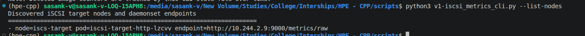
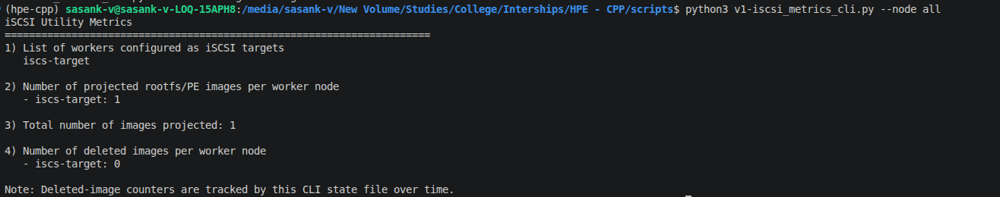
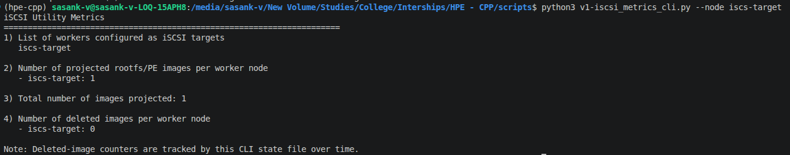

# iSCSI Management Utility - Python CLI

## Kubernetes Setup

Refer Week 7 work

## iSCSI Management Utility - Python CLI

A small CLI tool written in Python that uses the Kubernetes Python client to list cluster nodes, query iSCSI-related Pod and DaemonSet status, and perform node-level actions (e.g., reset or collect logs). It provides simple subcommands for targeting all nodes or a single node and outputs human-readable summaries and optional JSON for automation.

Refer the python script attached in the Week 8 Folder

## Results:

## References:

- Kubernetes python client docs: https://github.com/kubernetes-client/python/blob/master/kubernetes/README.md
