# Week 9 - Production Setup & Scripts for iSCSI

## Simulate Production Environment

### 1. iSCSI Target

#### 1. Add multiple disks to iscsi-target

1. Create iscsi_disks directory (if not present)

   ```
   sudo mkdir /var/lib/iscsi_disks
   ```

2. Create multiple empty disks using fileio backstores

   ```
   cd /backstores/fileio
   create disk01 /var/lib/iscsi_disks/disk01.img 50M
   create disk02 /var/lib/iscsi_disks/disk02.img 50M
   create disk03 /var/lib/iscsi_disks/disk03.img 50M
   create disk04 /var/lib/iscsi_disks/disk04.img 50M
   create disk05 /var/lib/iscsi_disks/disk05.img 50M
   create disk06 /var/lib/iscsi_disks/disk06.img 50M
   create disk07 /var/lib/iscsi_disks/disk07.img 50M
   create disk08 /var/lib/iscsi_disks/disk08.img 50M
   create disk09 /var/lib/iscsi_disks/disk09.img 50M
   create disk10 /var/lib/iscsi_disks/disk10.img 50M
   ```

   Command Description:

   ```
   create diskx /path/to/disk yyS
   ```

   - creates a empty image in the given file path with the mentioned size
   - create : action word
   - diskx : backstore lio disk label
   - /path/to/disk : real storage location of the disk on the host filesystem
   - yyS : size of the virtual disk (eg: 50M,10G)

   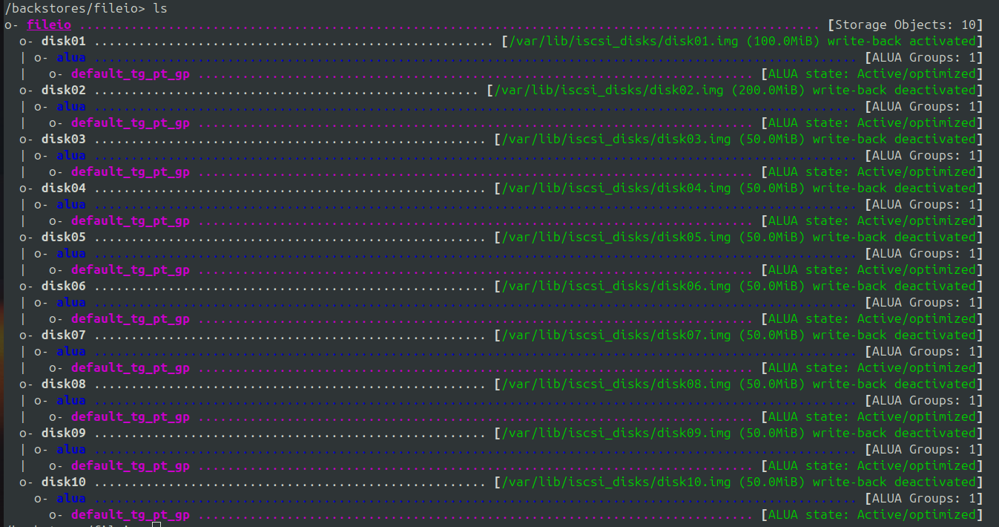

#### 2. Add multiple target iqns

1. Create multiple target iqns

   ```
   create iqn.2026-04.lab.local:lab.target01
   create iqn.2026-04.lab.local:lab.target02
   create iqn.2026-04.lab.local:lab.target03
   ```

   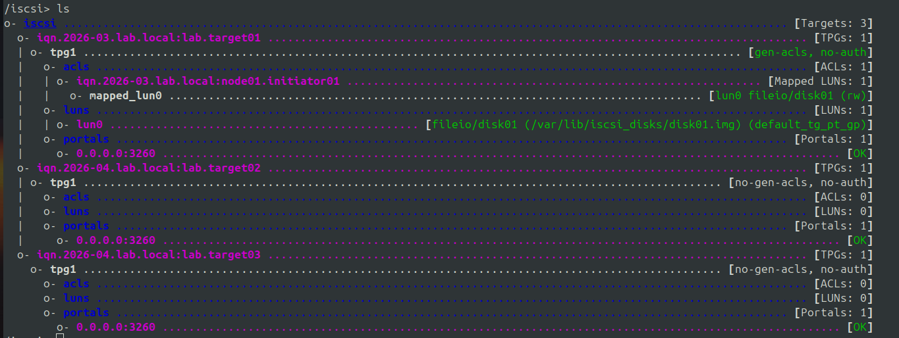

2. Create multiple tgpts inside all the iqns

   ```
   cd iqn.2026-03.lab.local:lab.target01/
   create 2
   ```

   Command description: create x
   - creates a new tpgt_x under the mentioned iqn
   - create : action
   - x : tag for the new tgpt

3. Set LUNs to the created tpgts

   ```
   cd /iqn.../tpgx/luns
   create /backstores/fileio/diskx
   ```

4. Create a client iqn in all the tpgts

   ```
   cd /iqn.../tpgx/acls
   create iqn.2026-04.lab.local:nodex.initiatory
   ```

   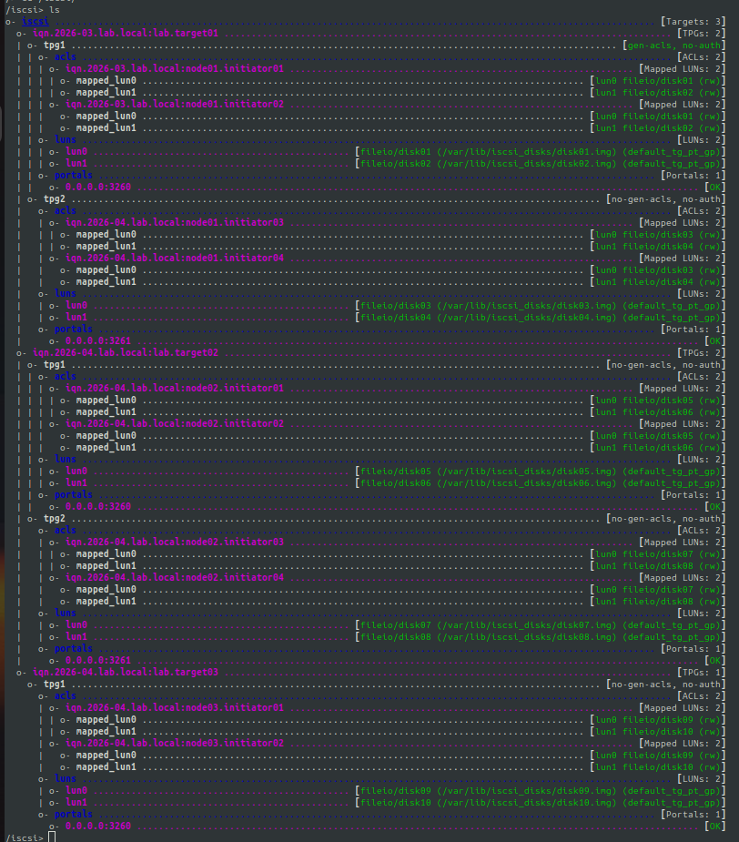

### 2. iSCSI Client

1. Discover the targets available in a particular ip

   ```
   sudo iscsiadm -m discovery -t sendtargets -p 192.168.122.197:3260
   sudo iscsiadm -m discovery -t sendtargets -p 192.168.122.197:3261

   ```

   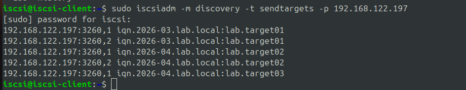

2. Mention the exact target and tpg you want to connect to and login

   ```
   sudo iscsiadm -m node -T iqn.2026-03.lab.local:lab.target01 -p 192.168.122.197:3260 --login

   # Verify using
   lsblk
   ```

   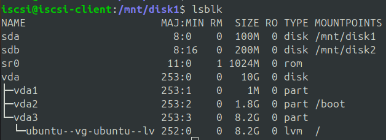

3. Make a ext4 filesystem (if doesn't exist)

   ```
    sudo mkfs.ext4 /dev/sda
    sudo mkfs.ext4 /dev/sdb
   ```

4. Mount the disk in a path

   ```
    sudo mkdir /mnt/disk1
    sudo mkdir /mnt/disk2

    sudo mount /dev/sda /mnt/disk1
    sudo mount /dev/sdb /mnt/disk2
   ```

5. Perform Read/Write

   ```
    sudo nano hello.txt
    "Hello, This is the first write operation in a iscsi disk"
    cat hello.txt
   ```

   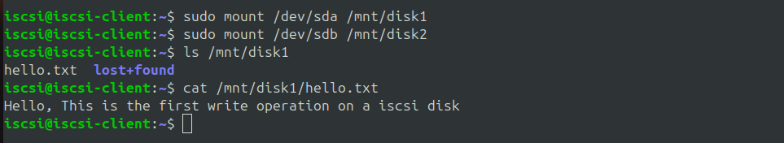

6. Observe the target for the metrics
   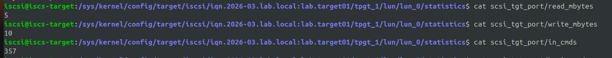

## Scripts to setup nodes for iSCSI

### 1. iSCSI Target

Setup:

- 10 LUNs ( Size = 50MB )
- 3 Targets
  - Target01
    - TPG1
      - lun1, lun2
      - iqn1
      - iqn2
    - TPG2
      - lun3, lun4
      - iqn1
      - iqn2
  - Target02
    - TPG1
      - lun5, lun6
      - iqn1
      - iqn2
    - TPG2
      - lun7, lun8
      - iqn1
      - iqn2
  - Target03
    - TPG1
      - lun9, lun10
      - iqn1

To configure a new ubuntu VM as iscsi-target with above architecture, run the following commands:

- Login as root user
  ```
  sudo -i
  ```
- Create a script file

  ```
  nano iscsi-target-setup.sh
  ```

- Copy the below script into the file

  ```bash

  #!/bin/bash
  set -e

  BASE_DIR="/var/lib/iscsi_disks"
  PORTAL_IP="0.0.0.0"

  CLIENT1="iqn.2026-04.lab.local:node1.initiator"
  CLIENT2="iqn.2026-04.lab.local:node2.initiator"

  CHAP_USER="username"
  CHAP_PASS="password"

  echo "[+] Installing targetcli"
  apt-get install -y
  apt-get install -y targetcli-fb

  echo "[+] Creating disk directory"
  mkdir -p $BASE_DIR

  echo "[+] Cleaning up disk directory"
  rm -f ${BASE_DIR}/disk*.img

  echo "[+] Reset config"
  targetcli clearconfig confirm=True || true

  echo "[+] Creating fileio disks"
  for i in $(seq -w 1 10); do
     targetcli /backstores/fileio create disk${i} ${BASE_DIR}/disk${i}.img 50M
  done

  create_tpg() {
     local TARGET=$1
     local TPG=$2
     local PORT=$3
     local DISK1=$4
     local DISK2=$5

     echo "[+] Configuring ${TARGET} TPG${TPG}"

     if [ $((TPG)) -ne 1 ]; then
           # TPG
           targetcli /iscsi/${TARGET} create ${TPG}
           # Portal
           targetcli /iscsi/${TARGET}/tpg${TPG}/portals create ${PORTAL_IP} ${PORT}
     fi

     # LUNs
     targetcli /iscsi/${TARGET}/tpg${TPG}/luns create /backstores/fileio/${DISK1}
     targetcli /iscsi/${TARGET}/tpg${TPG}/luns create /backstores/fileio/${DISK2}

     # Enable CHAP
     targetcli /iscsi/${TARGET}/tpg${TPG} set attribute authentication=1

     # ACLs + CHAP
     for CLIENT in $CLIENT1 $CLIENT2; do
        targetcli /iscsi/${TARGET}/tpg${TPG}/acls create ${CLIENT}

        targetcli /iscsi/${TARGET}/tpg${TPG}/acls/${CLIENT} \
              set auth userid=${CHAP_USER}

        targetcli /iscsi/${TARGET}/tpg${TPG}/acls/${CLIENT} \
              set auth password=${CHAP_PASS}
     done
  }

  TARGET1="iqn.2026-04.lab.local:lab.target01"
  TARGET2="iqn.2026-04.lab.local:lab.target02"
  TARGET3="iqn.2026-04.lab.local:lab.target03"

  echo "[+] Creating targets"
  targetcli /iscsi create ${TARGET1}
  targetcli /iscsi create ${TARGET2}
  targetcli /iscsi create ${TARGET3}

  create_tpg ${TARGET1} 1 3260 disk01 disk02
  create_tpg ${TARGET1} 2 3261 disk03 disk04

  create_tpg ${TARGET2} 1 3262 disk05 disk06
  create_tpg ${TARGET2} 2 3263 disk07 disk08

  create_tpg ${TARGET3} 1 3264 disk09 disk10

  echo "[+] Saving config"
  targetcli saveconfig

  echo "[+] Enabling iscsi service"
  systemctl enable rtslib-fb-targetctl

  echo "Setup complete with CHAP"

  ```

- Give execution permission to the script

  ```
  chmod +x iscsi-target-setup.sh
  ```

- Run the script

  ```
  ./iscsi-target-setup.sh
  ```

- Verify the setup

  ```
  targetcli ls
  ```

- Result
  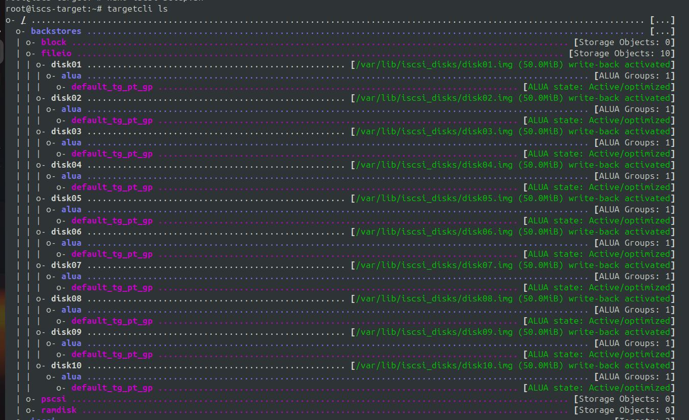
  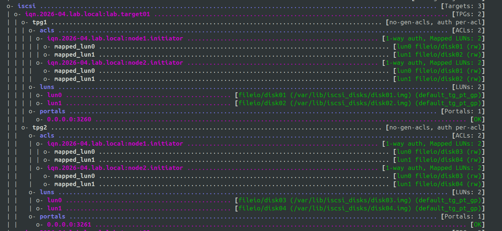
  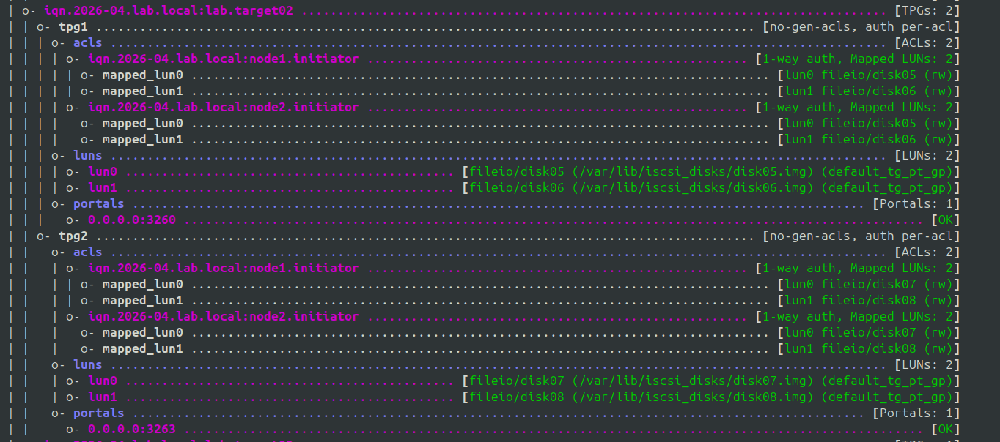
  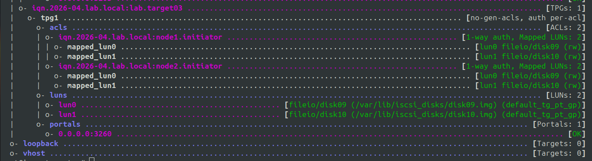

### 2. iSCSI Client

To configure a new ubuntu VM as iscsi-client to work with above iscsi-setup, run the following commands:

1. Login as root user
   ```
   sudo -i
   ```
2. Create a script file
   ```
   nano iscsi-client-setup.sh
   ```
3. Copy the below code to the script and modify the `TARGET_IP` and `CLIENT_IQN` if needed

   ```bash
   #!/bin/bash
   set -e

   # Add port if needed (eg: "192.168.122.197:3261" ), default port is 3260
   TARGET_IP="192.168.122.197"

   CLIENT_IQN="iqn.2026-04.lab.local:node1.initiator"
   CHAP_USER="username"
   CHAP_PASS="password"

   echo "[+] Clearing previous iscsi-client configs"
   systemctl stop open-iscsi || true
   systemctl stop iscsid || true
   iscsiadm -m node --logout || true
   iscsiadm -m node -o delete || true
   rm -rf /etc/iscsi/nodes/*
   rm -rf /etc/iscsi/send_targets/*
   apt purge open-iscsi -y

   echo "[+] Installing open-iscsi"
   apt-get update -y
   apt-get install -y open-iscsi

   echo "[+] Setting initiator IQN"
   sed -i "s|^InitiatorName=.*|InitiatorName=${CLIENT_IQN}|" /etc/iscsi/initiatorname.iscsi

   echo "[+] Configuring CHAP authentication"
   # Enable CHAP
   sed -i 's|^#*node.session.auth.authmethod.*|node.session.auth.authmethod = CHAP|' /etc/iscsi/iscsid.conf

   # Set username/password
   sed -i "s|^[[:space:]]*#*node.session.auth.username.*|node.session.auth.username = ${CHAP_USER}|" /etc/iscsi/iscsid.conf
   sed -i "s|^[[:space:]]*#*node.session.auth.password.*|node.session.auth.password = ${CHAP_PASS}|" /etc/iscsi/iscsid.conf

   echo "[+] Restarting services"
   systemctl restart iscsid
   systemctl restart open-iscsi

   echo "[+] Discovering targets"
   iscsiadm -m discovery -t sendtargets -p ${TARGET_IP}

   echo "[+] Logging into all discovered targets"
   iscsiadm -m node --login || true

   echo "[+] Enabling auto-login on boot"
   iscsiadm -m node -o update -n node.startup -v automatic

   echo "[+] Verifying sessions"
   iscsiadm -m session

   echo "[+] Checking block devices"
   lsblk

   echo "iSCSI client setup complete"
   ```

4. Make filesystem for iSCSI disk (if needed)
   ```
   mkfs.ext4 /dev/sdx
   ```
5. Mount the iSCSI disk

   ```
   # Create a directory (if needed)
   mkdir /mnt/diskx

   # Mount the disk in this path
   mount /dev/sdx /mnt/diskx
   ```

6. Perform I/O operations on the disk
   ```
   echo "Hello, I am groot!" > hello.txt
   cat hello.txt
   ```
7. Check the iSCSI target in path `/sys/kernel/config/target` for metrics
